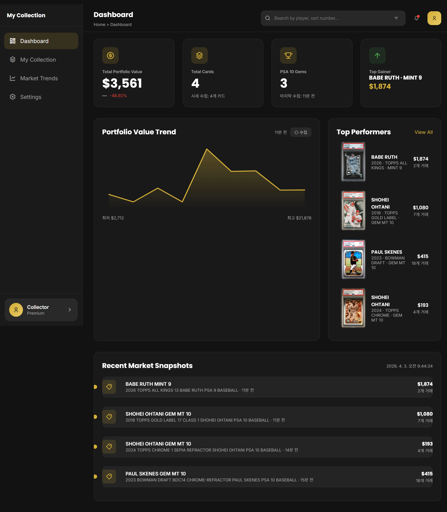
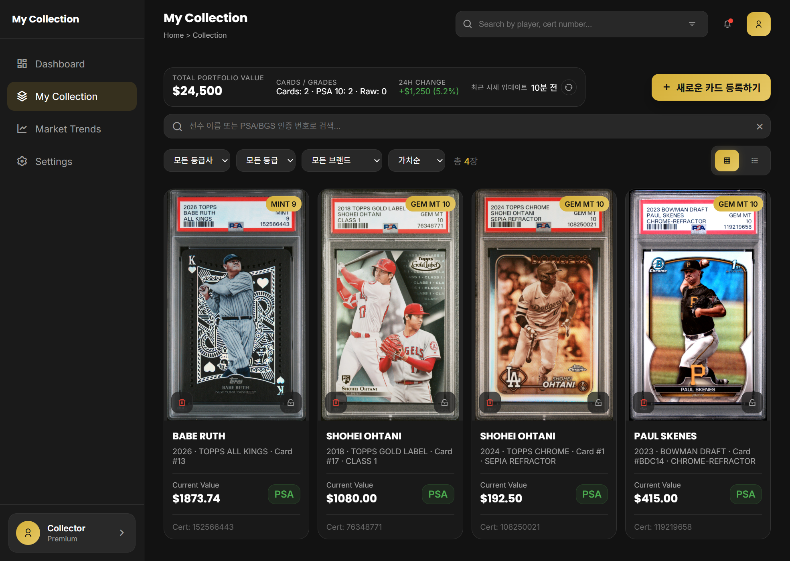
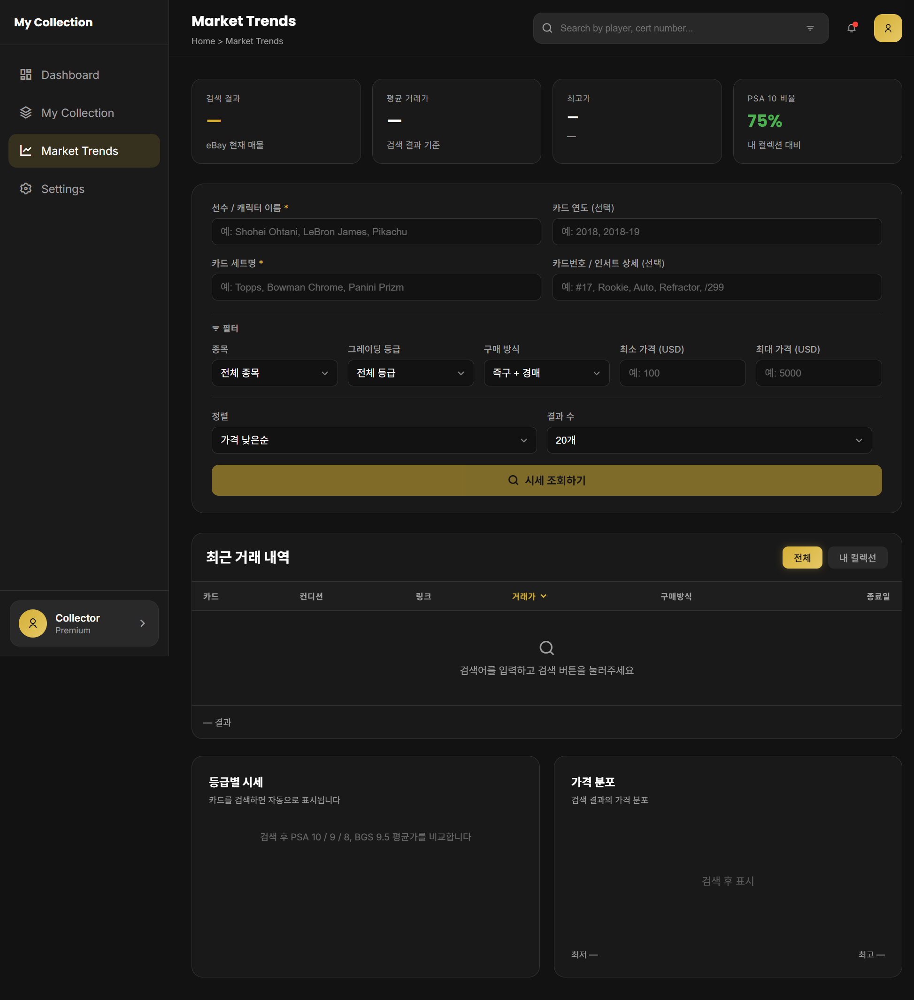
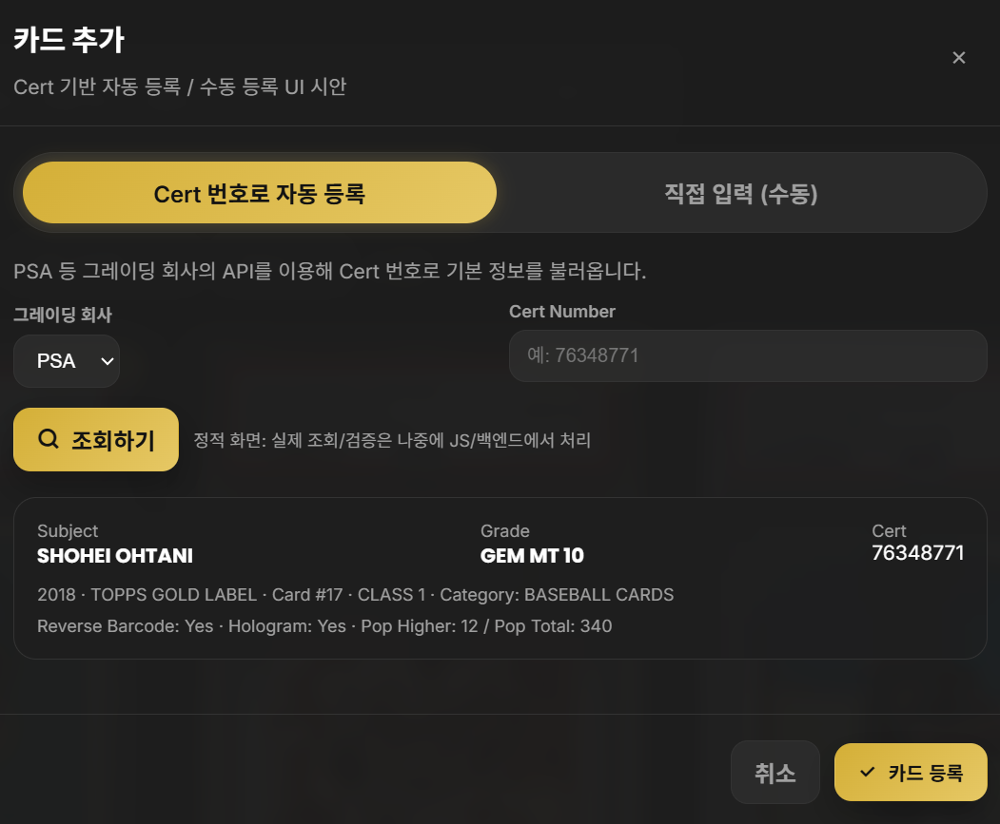
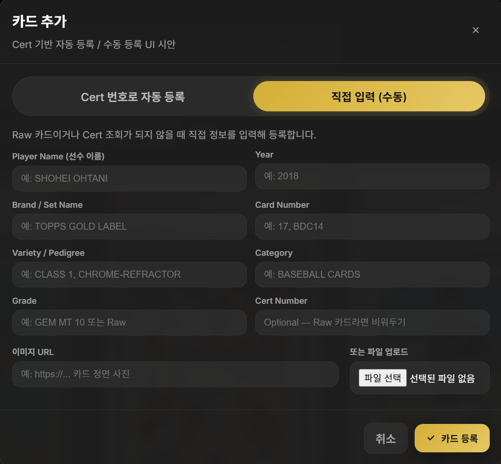

# 🗂️ My Collection

> **스포츠 카드 컬렉션 가치 추적 및 관리 웹 애플리케이션** ⚾
> 
> [🔗 프론트엔드 라이브 데모]([https://chyoung001.github.io/My_collection_/my_collection_frontend/src/pages/dashboard.html](https://chyoung001.github.io/My_collection_/))


<br/>

## 📝 프로젝트 소개
**My Collection**은 보유 중인 스포츠 카드의 목록을 체계적으로 관리하고, 가치 변화를 추적하기 위해 개발된 웹 서비스입니다. 
단순한 수동 기록을 넘어, **PSA Public API**를 활용한 카드 정보 자동 등록 기능을 지원하며 가치 변동 및 나의 컬렉션의 가치를 쉽게 파악하도록 도와줍니다.

<br/>

---
### 메인화면
> 포트폴리오 총액·보유 장 수·PSA 10 젬 수·단기 상승 상위 카드 등 요약 지표를 보여 주고</br>
> 포트폴리오 가치 추이(차트 영역), 기간별 상위 퍼포머, 최근 시장 활동(판매·가격 알림 등)으로 흐름을 한 번에 볼 수 있습니다.

<p align="center">
  
</p>

---

### 컬렉션 
> 컬렉션 관리 화면입니다. 포트폴리오 요약(총액, 장 수·등급, 24시간 변동, 시세 갱신 시각),</br>
> 선수·인증번호 검색, 등급사·등급·브랜드·정렬 필터, 새 카드 등록 흐름이 모여 있습니다.

<p align="center">
  
</p>


---

### 시세 검색
> 시세 검색 화면입니다. ebay api를 통한 실시간 판매 가격조회,</br>
> 

<p align="center">
  
</p>


--

### 상세화면 - 카드 등록
> PSA Cert 데이터 기반 자동 등록
<p align="center">
  
</p>

---
> RAW, 데이터가 없는 카드 수동 등록
<p align="center">
  
</p>

---


## 🛠️ 기술 스택

### Backend & Server
- **Runtime:** Node.js (ES Modules)
- **Framework:** Express.js

### Database
- **RDBMS:** PostgreSQL
- **Schema:** `my_collection_backend/schema.sql`

### 외부 API
- **시세 자동 수집:** LotRICH Vault API (Gemini Grounding — eBay 완료 거래 분석)
- **시세 수동 검색:** eBay Browse API
- **카드 인증:** PSA Public API

### API Docs & Tooling
- **Documentation:** Swagger UI — `http://localhost:4000/docs`

<br/>

## 🌐 API 엔드포인트

| Method | Endpoint | 설명 |
|---|---|---|
| GET | `/api/cards` | 전체 카드 목록 (최대 200개) |
| POST | `/api/cards` | 카드 수동 등록 |
| POST | `/api/cards/auto` | PSA 인증번호로 자동 등록 |
| DELETE | `/api/cards/:id` | 카드 삭제 |
| GET | `/api/dashboard/summary` | 포트폴리오 요약 (총액, 카드 수, 등급 분포) |
| GET | `/api/dashboard/top-cards` | 고가 카드 Top N |
| GET | `/api/dashboard/top-gainer` | 최고가 카드 |
| GET | `/api/market/search` | eBay 시세 수동 검색 (필터 지원) |
| GET | `/api/snapshots/latest` | 카드별 최신 시세 스냅샷 |
| GET | `/api/snapshots/:id/history` | 카드 시세 이력 (차트용) |
| GET | `/api/snapshots/summary` | 포트폴리오 시세 요약 |
| POST | `/api/snapshots/run` | 시세 수집 수동 트리거 |

전체 명세는 서버 실행 후 **`http://localhost:4000/docs`** 에서 확인할 수 있습니다.

<br/>

## 🚀 로컬 실행

### 1. 환경변수 설정

`my_collection_backend/.env` 파일 생성:

```env
PORT=4000
DATABASE_URL=postgresql://<user>:<password>@localhost:5432/<dbname>
PSA_API_BASE=https://api.psacard.com/publicapi
PSA_TOKEN=<PSA Bearer Token>
EBAY_CLIENT_ID=<eBay OAuth Client ID>
EBAY_CLIENT_SECRET=<eBay OAuth Client Secret>
```

### 2. DB 초기화

```bash
psql -U <user> -d <dbname> -f my_collection_backend/schema.sql
```

### 3. 백엔드 실행

```bash
cd my_collection_backend
npm install
npm run dev
```

### 4. 프론트엔드 실행

`my_collection_frontend/src/pages/dashboard.html` 을 Live Server 등으로 열어서 사용합니다.

<br/>

## 🌍 외부 PC에서 시연 (ngrok)

```bash
ngrok http 4000
```

Forwarding URL을 복사한 뒤 프론트 URL에 `?apiBase=` 파라미터로 전달합니다.

```
https://chyoung001.github.io/My_collection_/my_collection_frontend/src/pages/dashboard.html?apiBase=https://xxxx.ngrok-free.app
```

> ngrok Free 플랜은 실행할 때마다 URL이 바뀝니다. 시연 시 매번 새 URL을 반영하세요.

<br>

